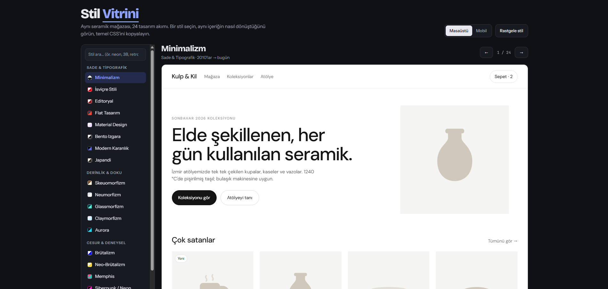

# Stil Vitrini

**Aynı mağaza sayfası, 24 tasarım akımı.**

Stil Vitrini, yazılımcılar ve tasarımcılar için hazırlanmış interaktif bir UI stil kataloğudur. Tek bir e-ticaret sayfası (hayali bir seramik atölyesi: *Kulp & Kil*) Minimalizm'den Vaporwave'e kadar 24 farklı tasarım stiliyle gösterilir. HTML hiç değişmez; yalnızca CSS değişir. Böylece her stilin aynı içeriğe ne kattığını yan yana görebilirsiniz.

🔗 **Canlı demo:** `https://<iBerkayYildirim>.github.io/<Stil-Vitrini>/`



---

## Özellikler

- **24 tasarım stili:** Her biri aynı mağaza sayfasını baştan sona yeniden giydirir.
- **Stile özel animasyonlar:** Siberpunk'ta glitch, Terminal'de daktilo efekti, Material'da ripple, Vaporwave'de kayan neon ızgara, Japandi'de kendini çizen ensō dairesi ve daha fazlası.
- **Temel CSS'i kopyala:** Her stilin en belirleyici CSS parçası tek tıkla kopyalanır.
- **Renk paleti:** Renk kutusuna tıklayınca hex kodu kopyalanır.
- **Stil notları:** Her stilin dönemi, belirgin özellikleri, nerede iyi gittiği ve nelere dikkat edilmesi gerektiği.
- **Masaüstü / Mobil önizleme:** Mağaza, ekrana göre değil kendi kutusunun genişliğine göre uyum sağlar (container queries), böylece mobil görünüm anında test edilebilir.
- **Arama ve gezinme:** Stil adı veya etiketle arama (`neon`, `retro`, `3b`…), `←` `→` tuşlarıyla gezinme, rastgele stil düğmesi.
- **Doğrudan link:** Her stilin kendi adresi vardır, örneğin `#glass`, `#win95`, `#vapor`.
- **Açık / koyu tema:** Katalog arayüzü sistem temasına uyar.
- **Erişilebilirlik:** Klavyeyle gezinme, görünür odak halkası ve `prefers-reduced-motion` desteği (hareketi azalt ayarı açıksa tüm animasyonlar kapanır).
- **Sıfır bağımlılık:** Framework yok, build adımı yok. Tek bir HTML dosyası.

## Stiller

| Grup | Stiller |
|---|---|
| **Sade & Tipografik** | Minimalizm, İsviçre Stili, Editoryal, Flat Tasarım, Material Design, Bento Izgara, Modern Karanlık, Japandi |
| **Derinlik & Doku** | Skeuomorfizm, Neumorfizm, Glassmorfizm, Claymorfizm, Aurora |
| **Cesur & Deneysel** | Brütalizm, Neo-Brütalizm, Memphis, Siberpunk / Neon |
| **Retro & Nostalji** | Windows 95, Y2K, Terminal / CRT, Art Deco, Bauhaus, Vaporwave, Piksel Sanatı |

## Hızlı başlangıç

Kurulum gerekmez. Depoyu klonlayıp `index.html` dosyasını tarayıcıda açmanız yeterli:

```bash
git clone https://github.com/<iBerkayYildirim>/<Stil-Vitrini>.git
```

Yerel bir sunucuda çalıştırmak isterseniz:

```bash
npx serve .
```

### GitHub Pages ile yayınlama

1. Depoyu GitHub'a gönderin.
2. **Settings → Pages** bölümüne gidin.
3. **Source** olarak `Deploy from a branch`, dal olarak `main` ve klasör olarak `/ (root)` seçin.
4. Birkaç dakika içinde site `https://<iBerkayYildirim>.github.io/<Stil-Vitrini>/` adresinde yayında olur.

## Proje yapısı

```
.
├── index.html   # Tüm uygulama: HTML, CSS ve JS tek dosyada
└── README.md
```

`index.html` içinde bölümler şu sırayla yer alır:

1. **Katalog kabuğu CSS'i:** Tema değişkenleri (açık/koyu), kenar çubuğu, önizleme alanı, bilgi kartları.
2. **Mağaza iskeleti CSS'i:** Tüm stillerin paylaştığı yerleşim (`.s-nav`, `.s-hero`, `.s-grid`, `.s-card` …) ve ortak keyframe'ler.
3. **Stil blokları:** Her stil `.st-<id>` sınıfıyla kapsamlanmış kendi bloğundadır.
4. **Container query'ler:** Mağazanın dar genişliklerdeki davranışı.
5. **Mağaza HTML'i:** Tek bir `.shop` öğesi; stil değişince yalnızca sınıfı değişir.
6. **JS:** `STYLES` veri dizisi, kenar çubuğu, stil seçimi, animasyon tetikleyicileri.

## Nasıl çalışır?

Mağazanın HTML'i sabittir. Stil seçildiğinde yalnızca kök öğenin sınıfı değişir:

```html
<div class="shop st-glass" id="shop"> … </div>
```

Her stil, ortak sınıf adlarını kendi kapsamı altında yeniden tanımlar:

```css
.st-glass .s-card {
  background: rgba(255,255,255,.14);
  backdrop-filter: blur(16px) saturate(160%);
  border: 1px solid rgba(255,255,255,.32);
  border-radius: 22px;
}
```

Mağaza, sayfanın değil kendi kapsayıcısının genişliğine göre uyum sağlar:

```css
.stage { container-type: inline-size; }

@container (max-width: 760px) {
  .shop .s-grid { grid-template-columns: repeat(2, minmax(0, 1fr)); }
}
```

Stile özel arka plan süslemeleri (Aurora lekeleri, Vaporwave güneşi, Bauhaus şekilleri, piksel bulutlar…) varsayılan olarak gizli olan `.s-fx` katmanında yaşar; her stil ihtiyaç duyarsa bu katmanı açar. Aynı şekilde kayan duyuru şeridi `.s-ticker` da yalnızca onu kullanan stillerde görünür.

## Yeni stil ekleme

1. **CSS bloğunu yazın.** Diğer stil bloklarının yanına yeni bir blok ekleyin ve tüm seçicileri `.st-<id>` ile başlatın:

   ```css
   /* ---------- 25. Stilim ---------- */
   .st-stilim { background: #fff; color: #111; font-family: 'Bir Font', sans-serif; }
   .st-stilim .s-btn  { /* … */ }
   .st-stilim .s-card { /* … */ }
   ```

   Mağazada stillendirebileceğiniz sınıflar:

   | Bölüm | Sınıflar |
   |---|---|
   | Menü | `.s-nav`, `.s-logo`, `.s-links`, `.s-cart` |
   | Şerit | `.s-ticker` (varsayılan gizli) |
   | Hero | `.s-hero`, `.s-hero-text`, `.s-eyebrow`, `.s-title`, `.s-lead`, `.s-actions`, `.s-btn`, `.s-btn2`, `.s-hero-art` |
   | Ürünler | `.s-products`, `.s-sechead`, `.s-grid`, `.s-card`, `.s-badge`, `.s-img`, `.s-name`, `.s-desc`, `.s-row`, `.s-price`, `.s-add` |
   | Bülten | `.s-news`, `.s-form`, `.s-input` |
   | Alt bilgi | `.s-foot` |
   | Süsleme | `.s-fx` ve içindeki 4 adet `<i>` (varsayılan gizli) |

2. **Veriyi ekleyin.** `STYLES` dizisine bir nesne ekleyin:

   ```js
   {
     id: "stilim",               // .st-stilim ve #stilim linki
     name: "Stilim",
     g: 2,                       // 0: Sade, 1: Derinlik, 2: Cesur, 3: Retro
     era: "2024 → bugün",
     tags: "anahtar kelimeler aramada kullanılır",
     summary: "Tek cümlelik tanım.",
     traits: ["Özellik 1", "Özellik 2", "Özellik 3"],
     use: "Nerede iyi gider.",
     avoid: "Nelere dikkat edilmeli.",
     palette: ["#ffffff", "#111111", "#ff0055"],
     css: `.btn { /* kopyalanacak temel CSS */ }`
   }
   ```

3. **Font gerekiyorsa** dosyanın başındaki Google Fonts bağlantısına ekleyin.

4. **Hareket ekliyorsanız** mevcut `sv-*` keyframe'lerini (`sv-float`, `sv-spin`, `sv-jelly`, `sv-drift`, `sv-twinkle` …) yeniden kullanmayı deneyin. `prefers-reduced-motion` kuralı, mağaza içindeki tüm animasyonları zaten otomatik olarak kapatır.

## Kullanılan teknikler

- CSS Container Queries (`container-type`, `@container`)
- `backdrop-filter` (Glassmorfizm, Aurora)
- `@property` ile animasyonlu açı değişkeni ve `mask: conic-gradient()` (Japandi ensō dairesi)
- `clip-path` (Siberpunk kesik köşeler, Bauhaus üçgeni, İsviçre perde açılışı)
- `background-clip: text` (Y2K krom yazı, Art Deco altın parıltı, Aurora gradyan başlıklar)
- `perspective` + `rotateX` (Vaporwave ızgara zemin)
- `steps()` zamanlama fonksiyonu (Piksel Sanatı, Windows 95, Terminal imleci)
- Çoklu `box-shadow` (Neumorfizm, Claymorfizm, Windows 95 bevel, piksel kenarlar)
- Bağımsız transform özellikleri (`translate`, `scale`, `rotate`) ile çakışmayan animasyonlar
- CSS değişkenleriyle fareyi takip eden spotlight (Modern Karanlık)
- Google Fonts: Bricolage Grotesque, Instrument Sans, JetBrains Mono ve stiller için 20'den fazla yazı tipi

## Tarayıcı desteği

Chrome, Edge, Safari ve Firefox'un güncel sürümlerinde çalışır. Container queries ve `@property` desteği olmayan eski tarayıcılarda bazı yerleşim ve animasyon detayları sadeleşir, ancak sayfa kullanılabilir kalır.

## Katkıda bulunma

Yeni stil önerileri ve düzeltmeler memnuniyetle karşılanır:

1. Depoyu fork'layın.
2. Yeni bir dal açın: `git checkout -b stil/stilim`
3. Yukarıdaki [Yeni stil ekleme](#yeni-stil-ekleme) adımlarını izleyin.
4. Değişikliğinizi hem masaüstü hem mobil önizlemede kontrol edin.
5. Pull request açın; açıklamaya bir ekran görüntüsü eklemeyi unutmayın.

## Lisans

[MIT](LICENSE)

Mağaza içeriği (Kulp & Kil, ürünler ve fiyatlar) tamamen hayalidir ve yalnızca gösterim amaçlıdır.
